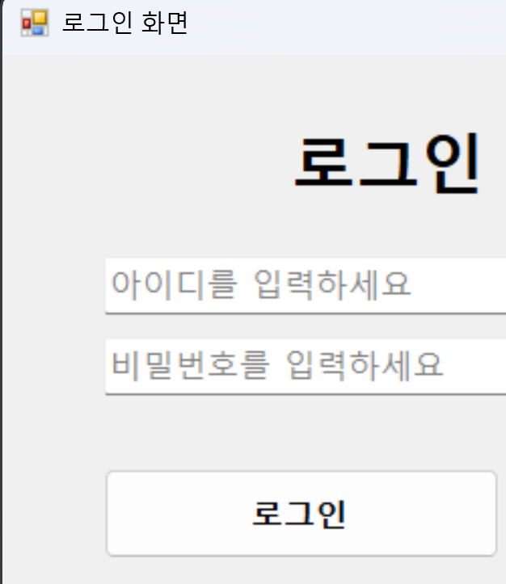
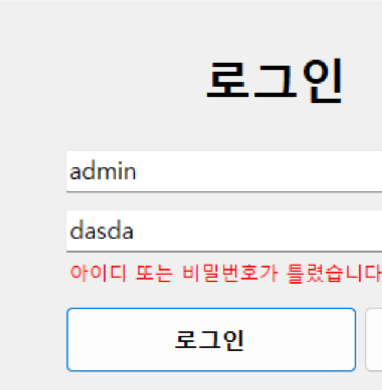
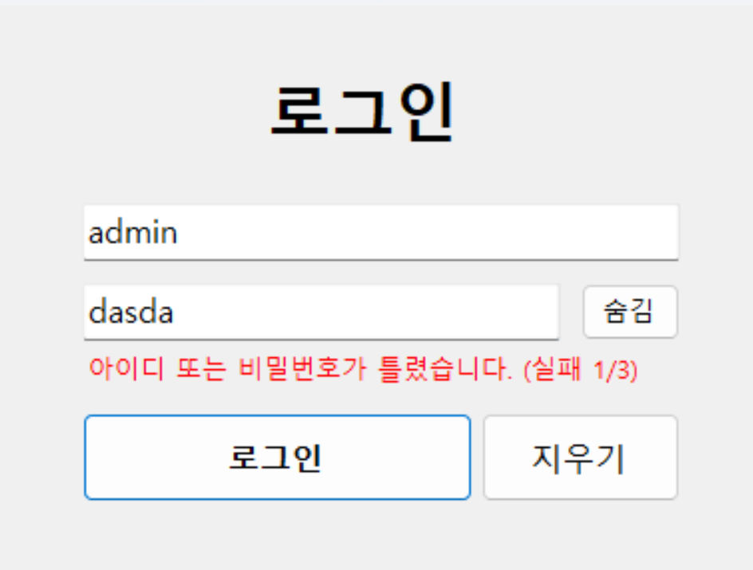
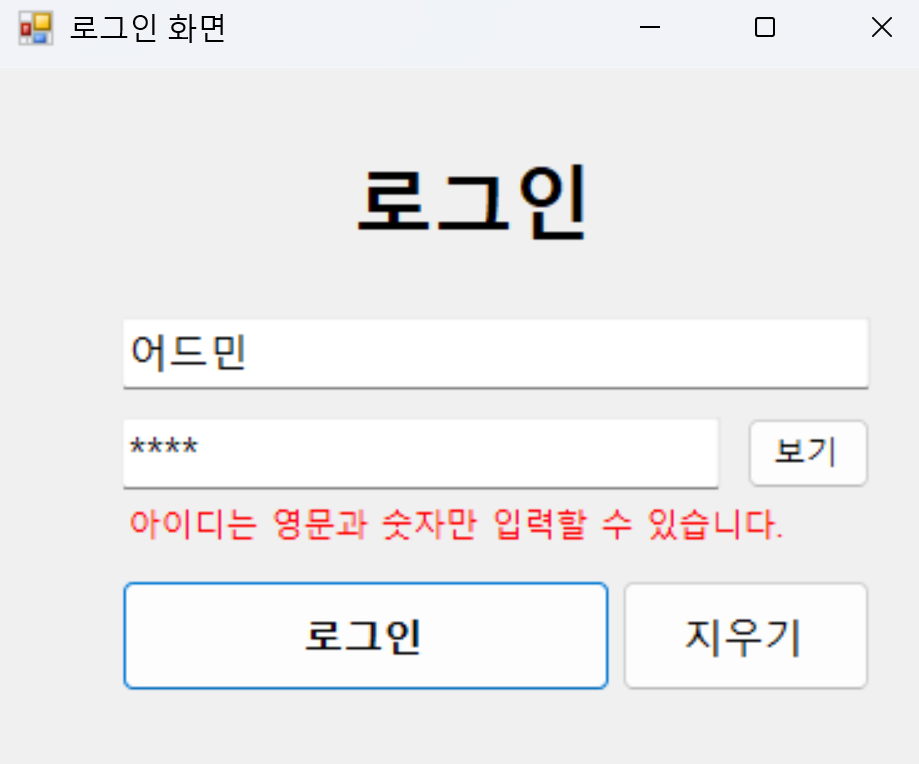

# (C# 코딩) 로그인 화면 (Login Screen)

## 개요
- C# 프로그래밍 학습
- 1줄 소개: 사용자의 아이디와 비밀번호를 입력받고 검증하여 처리하는 윈도우 폼 프로그램
- 사용한 플랫폼: 
  - C#, .NET Windows Forms, Visual Studio, GitHub
- 사용한 컨트롤:
  - Label, TextBox, Button, Timer
- 사용한 기술과 구현한 기능:
  - Visual Studio를 이용하여 UI 디자인 구성
  - `GotFocus`, `LostFocus` 이벤트를 이용한 텍스트박스 입력 유도 힌트(Placeholder) 구현
  - `KeyDown` 이벤트를 응용해 Enter 키로 즉각적인 화면 포커스 이동 및 클릭 연동
  - 정규식(`Regex`)과 `string` 유효성 검사를 통해 영문/숫자 검증 로직 처리
  - `Timer` 클래스를 이용해 로그인 제한 횟수 도달 시 일정 시간 동안 록아웃(Lock-out) 타이머 구현

---

## 실행 화면 (과제 1)
- 과제 1 코드의 실행 스크린샷

- 과제 내용
  - 아이디를 입력하는 창, 패스워드를 입력하는 창, 로그인 버튼을 적절히 배치합니다.
  - 텍스트박스에 Placeholder 기능을 구현하여 입력 힌트를 회색으로 표시합니다.
  - 아이디와 패스워드가 모두 맞아야 로그인 성공 메시지를 띄웁니다.
- 구현 내용과 기능 설명
  - 입력창을 마우스로 클릭하면 안내 문구가 지워지며 텍스트가 흑색으로 바뀐다.
  - 사전에 지정된 ID(`admin`)와 PW(`1234`) 일치 여부에 따라 각각 다른 알림 상자(MessageBox)를 띄워준다.

---

## 실행 화면 (과제 2)
- 과제 2 코드의 실행 스크린샷

- 과제 내용
  - 아이디 또는 패스워드가 잘못 입력되었을 때 에러 메시지를 보여줍니다.
  - MessageBox를 띄우지 말고 직관적으로 폼 화면상에 직접 보여줍니다.
- 구현 내용과 기능 설명
  - 로그인 실패 시 나타날 빨간색 `Label` 컨트롤을 입력칸 하단에 추가했다.
  - Visible 속성을 조정하여 오류 발생 시에만 나타나고, 입력창을 갱신하려 다시 클릭하면 깔끔하게 사라진다.

---

## 실행 화면 (과제 3)
- 과제 3 코드의 실행 스크린샷

- 과제 내용
  - Enter 키를 치면 포커스가 다음 창으로 이동하고, 패스워드 창에서는 바로 로그인되도록 합니다.
  - 전체를 처음으로 되돌려 지우는 기능과 패스워드를 보여주는 기능을 추가합니다.
- 구현 내용과 기능 설명
  - 아이디 창에서 Enter 타이핑 시 패스워드 창으로 즉시 포커스가 내려가며, 패스워드 창에서 Enter 시 로그인 이벤트가 자동 실행된다.
  - '지우기' 버튼을 누르면 입력값이 전부 초기화되고 힌트가 표시된 첫 폼 화면상태로 되돌아간다.
  - '보기/숨김' 토글 버튼을 추가하여, `*` 로 마스킹 된 비밀번호 문자를 즉각 열람하거나 숨길 수 있다.

---

## 실행 화면 (과제 4)
- 과제 4 코드의 실행 스크린샷

- 과제 내용
  - 아이디와 패스워드 입력 문자 확인(유효성 검증).
  - 로그인 시도를 제한하여 3번 실패 시 정해진 시간이 지난 후에 재시도하게 만들기.
- 구현 내용과 기능 설명
  - 아이디에는 정규식을 검사하여 특수기호나 띄어쓰기를 칠 수 없게 만들었고 패스워드는 무조건 4글자 이상이어야 한다.
  - 비밀번호를 3회 초과하여 틀릴 시 화면의 모든 입력을 잠그며 막는다.
  - 보이지 않는 백그라운드에 세팅해 둔 1초 사이클의 Timer가 가동되며 "10초 후 다시 시도하세요" 라는 카운터 텍스트가 표시된다. 10초 후에야 처음처럼 다시 풀려난다.

---

## 배운 내용
- C#의 WinForms 내부에서 이벤트 리스너를 컨트롤에 바인딩하고 상태 값에 따라 UI 속성(`Visible`, `Enabled`, `PasswordChar` 등)을 동적으로 변환하는 원리에 익숙해질 수 있었다.
- 단순히 기능을 돌아가게 만드는 것이 아니라, 실제 애플리케이션 화면처럼 힌트를 관리하고 에러 메시지를 눈에 잘 띄게 위치시키는 UX의 관점을 다룰 수 있어 흥미로웠다.